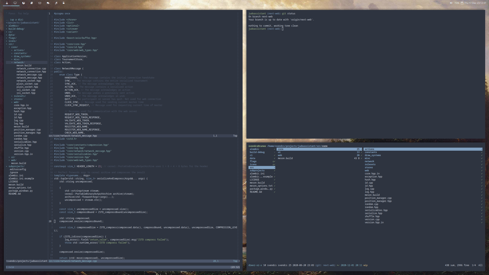

Svend's Dotfiles
================
This repository contains my dotfiles that I have tweaked over the years.
Everything is optimized for a dual-monitor desktop setup.

<table>
  <tr>
    <th>OS</th>
    <th>Desktop</th>
    <th>Terminal</th>
    <th>Shell</th>
    <th>Editor</th>
    <th>Font</th>
    <th>Colors</th>
  </tr>
  <tr>
    <td><a href="https://www.archlinux.org/">Arch Linux</a></td>
    <td><a href="https://i3wm.org/">i3 wm</a> with <a href="https://github.com/polybar/polybar">polybar</a></td>
    <td><a href="https://github.com/alacritty/alacritty">Alacritty</a></td>
    <td><a href="https://wiki.archlinux.org/index.php/Zsh">Zsh</a></td>
    <td><a href="https://neovim.io/">Neovim</a></td>
    <td><a href="https://www.google.com/get/noto/">Noto Sans Mono</a></td>
    <td><a href="https://www.nordtheme.com/">Nord</a></td>
  </tr>
</table>

Installing
----------
The entire setup can be installed by roughly following the steps below:

1. Install a base Arch Linux system by following the [Arch Wiki](https://wiki.archlinux.org/) guides. Use [arch-setup.md](arch-setup.md) as reference.
2. Install system packages listed in [packages.md](packages.md).
3. Install system-wide configuration files by running `sudo ./install-system`.
5. Clone the repository and run `./install` to symlink the dotfiles into place.
   If a file already exists you will be prompted to overwrite it.

Screenshot
----------

